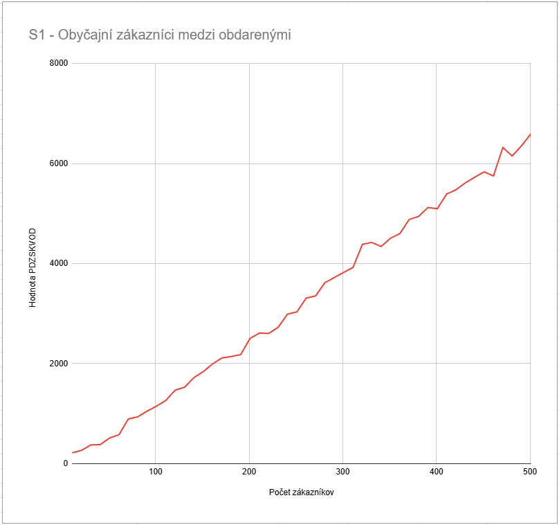
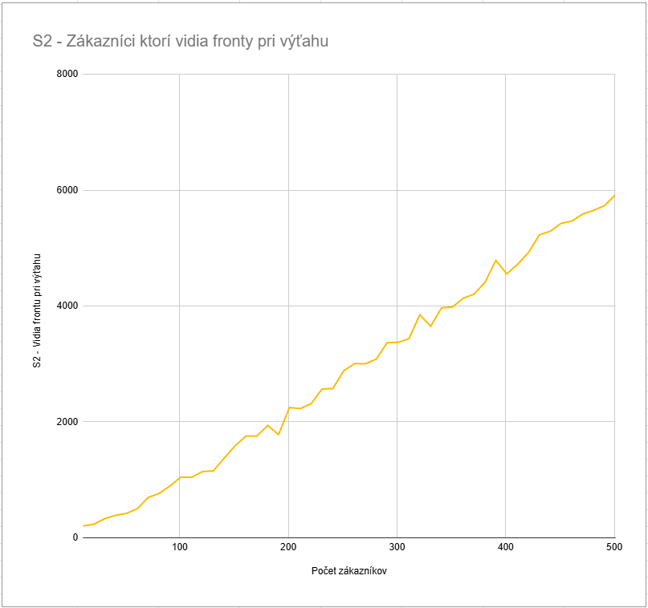
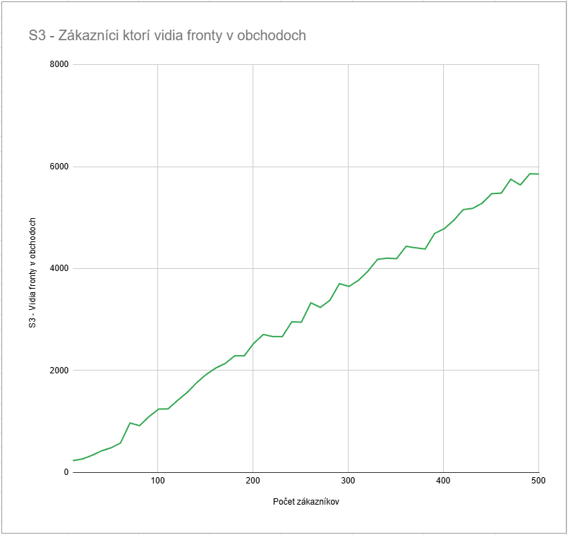

# Pozorovanie hodnoty PDZSKVOD v obchodnom dome
### Kateřina Pešoutová, Matúš Gromnica

Spustili sme test pre 11 - 501 zákazníkov, najprv bez schopností, potom so schopnosťami.

  

Zistili sme, že aj keď na prvý pohľad rastú všetky hodnoty podobne, našli sme rozdiely a výhody. 
Hodnota PDZSKVOD rástla pri zákazníkoch bez schopností takmer lineárne. 
Pri teste so schopnosťami sme si ale všimli, že zákazníci, ktorí vidia frontu pri výťahu mali po väčšinu testov najlepšie výsledky, ale pri vysokom počte sa vyrovnali zákazníkom ktorí vidia fronty v obchodoch. 
Pri obdarených zákazníkoch však obyčajní trpeli a ich časy sa zhoršili.

  
  

  
  

    Grafické znázornenie rastu hodnoty PDZSKVOD v závislosti na počet zákazníkov v rôznych prípadoch

 

## Rozdelenie práce

Pri písaní kódu sme súbežne písali obe časti pre ušetrenie času - Matúš G.: Generátor nového súboru, Kateřina P.: Schopnosti zákazníkov. Následne sme spolu program testovali a dolaďovali a na záver spísali výsledky pozorovania.

 
 

Zdrojový kód je v prílohe.